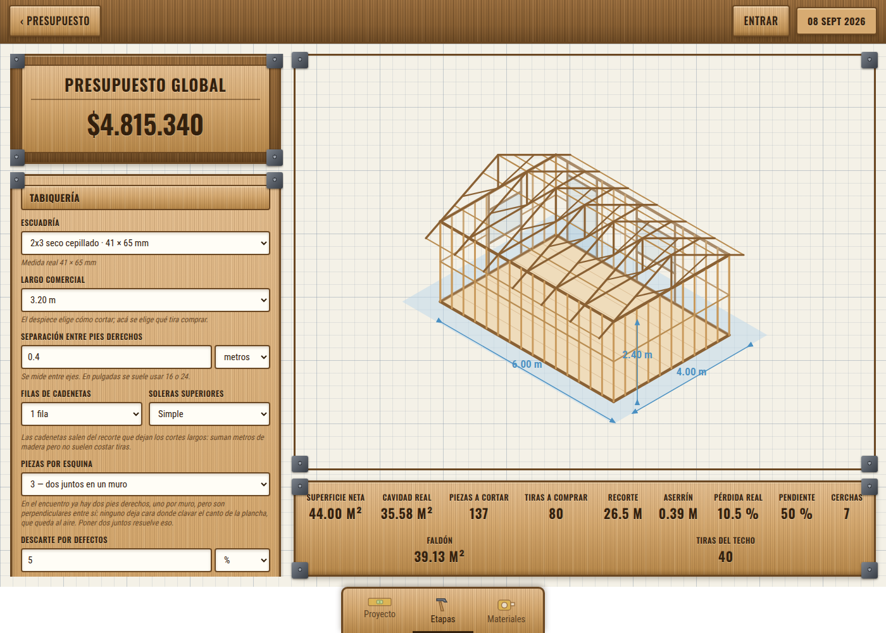
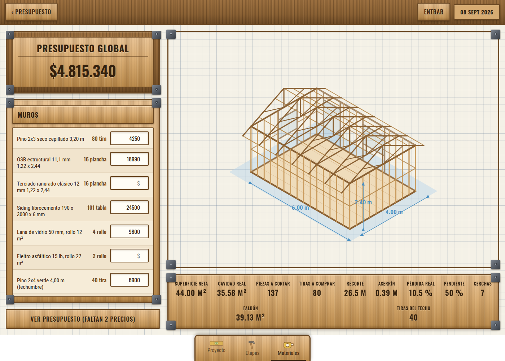
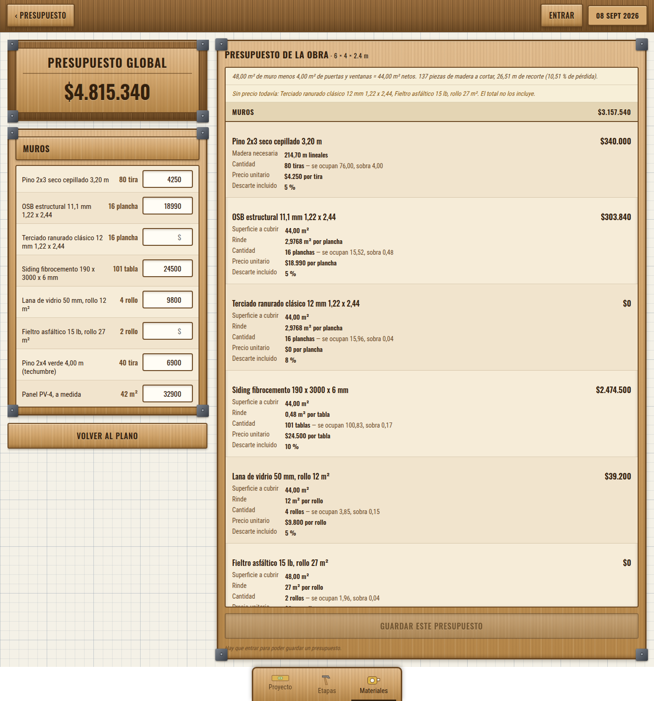
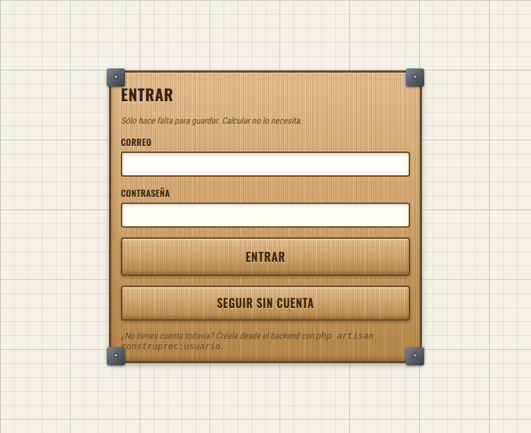

# Construprec

Calculadora de presupuestos de construcción en madera. El usuario ingresa la
**geometría** de lo que va a construir y la aplicación **deduce qué materiales
hacen falta y cuántos**; sólo entonces pide los precios y arma el presupuesto.

Ese orden es la idea central del producto. Nadie arma una lista de materiales a
mano: se sabe que el muro mide 6 metros y que los pies derechos van cada 40
centímetros, y de ahí tiene que salir todo lo demás.

---

## Cómo se usa

### 1. Proyecto — la geometría


Se escriben las medidas de la planta y de ahí salen las cuatro caras. Cada cara
recibe sus puertas y ventanas, con tipo, cantidad y medidas.

**El dibujo no es una ilustración.** Se genera desde las mismas medidas con que
se calcula el presupuesto: los pies derechos que se ven son los que se van a
comprar. Si se cambia la separación de 40 a 60 cm, el dibujo cambia con ella. Eso
hace visible un error de tipeo que en una tabla de números pasaría inadvertido.

La barra de abajo muestra las cifras de obra en vivo: superficie neta, cavidad
real, piezas a cortar, tiras a comprar, recorte y pérdida.

### 2. Etapas — cómo se arma



La escuadría, el largo comercial, la separación entre pies derechos, las filas de
cadenetas, el refuerzo de esquina y el producto de cada capa. Abajo, la
techumbre, que se activa con una casilla porque un proyecto puede quedarse en los
muros mientras se decide el techo.

Todo recalcula al instante contra la API. Ese ida y vuelta es lo que convierte la
aplicación en una herramienta de decisión: se ve al momento qué cuesta separar a
60 en vez de 40, o poner terciado ranurado en vez de yeso-cartón.

### 3. Materiales — los precios



La lista de lo que hay que comprar, con una casilla de precio al lado de cada
material. **Las cantidades ya están resueltas**: no dependen del precio, así que
se calculan y se muestran antes de preguntarlo.

### 4. El presupuesto



Cada partida dice la superficie a cubrir, cuánto rinde una unidad, la cantidad,
el precio unitario y el subtotal. *"16 planchas"* obliga a confiar; *"16 planchas
para cubrir 44 m², rindiendo 2,9768 cada una"* se puede comprobar con una
calculadora en la mano, que es lo que hace cualquiera antes de gastar medio
millón de pesos.

Se agrupa por etapa con su subtotal, porque comparar cuánto cuesta el techo
aparte de los muros es justo la decisión que se toma mirando el documento. Y se
descarga en PDF.

### 5. Entrar



La sesión sólo hace falta para **guardar**. Calcular no la necesita: se puede
usar todo el asistente sin cuenta y entrar recién cuando haya que conservar el
trabajo. Pedir registro antes de saber si la herramienta sirve espanta a quien
venía a probarla.

---

## Stack

| Capa | Elección | Por qué |
|---|---|---|
| API | Laravel 13 · PHP 8.4 | Corre en hosting compartido sin pelear con procesos ni entornos virtuales |
| Base | MySQL 8 | Lo que ofrece el hosting; PostgreSQL habría exigido otro servidor |
| Interfaz | React 19 + Vite | Aplicación con estado: el asistente recalcula en cada pulsación |
| Sesión | Sanctum, tokens | La API y el sitio viven en dominios distintos |
| PDF | dompdf | PHP puro: en hosting compartido no hay dónde instalar un navegador headless |
| Tipografías | @fontsource | Auto-hospedadas, sin pedirle nada a Google en cada carga |
| Tests | Pest | 208 casos, verdes contra SQLite y contra MySQL |
| Análisis | PHPStan nivel 5 (Larastan) · Pint · oxlint | |

**Sin Redis, sin Horizon, sin Telescope.** El hosting no tiene procesos
permanentes: sesión, caché y colas van a la base de datos, y lo periódico va por
cron.

---

## Arquitectura

```
backend/app/
  Support/            Medida y Unidad: toda medida en milímetros enteros
  Services/
    Madera/           Pieza, Despiece, plan de corte — compartido por todo
    Tabiqueria/       Despiece de muros: vanos, cadenetas, esquinas
    Techumbre/        Despiece de cerchas
    Capas/            Consumo de recubrimientos sobre una superficie
    Monedas/          Conversión vía dólar
    Presupuesto/      Calculadora, guardado, armado del presupuesto
  Models/             Eloquent, con el puente hacia los objetos de valor
  Http/               Requests (validación) → Controllers (delegan)

frontend/src/
  estilos/            Tema en gradientes CSS, sin imágenes
  componentes/        Panel, campos, editor de vanos, plano isométrico
  api.js              Cliente de la API
  App.jsx             Estado y composición
```

### El motor no conoce Eloquent

Toda la lógica de cálculo recibe y devuelve **objetos de valor**. `Calculadora`
no sabe qué es una fila de base de datos: `CalculoProyectoService` traduce un
proyecto guardado a esos objetos, y el controlador traduce lo que llega por HTTP.

Eso permite dos cosas. El motor se prueba sin base de datos, y **el mismo cálculo
sirve para un proyecto guardado y para uno que el usuario todavía arma en
pantalla**, sin duplicar una sola regla.

### El cálculo no guarda nada

`POST /api/calculos` es una consulta pura. El asistente recalcula en cada
pulsación, y persistir cada una llenaría la base de proyectos que nadie pidió.
Guardar es un paso aparte que el usuario decide. Hay un test que lo fija contando
filas después de calcular.

---

## Decisiones de fondo

### Toda medida entra en milímetros enteros

La regla del producto es que **cada campo deja elegir su unidad**: se puede
escribir la escuadría en pulgadas aunque el muro esté en metros. Internamente hay
una sola representación, milímetros enteros.

Si cada paso del cálculo convirtiera entre metros, pies y pulgadas, el error de
redondeo se acumularía a lo largo de un muro y el despiece dejaría de cuadrar.
Convertir una vez al entrar y una vez al mostrar acota el error a esos dos
puntos.

Cada fila recuerda en qué unidad se escribió, sólo para mostrarla de vuelta
igual. Y cada unidad se muestra con los decimales que puede representar: 16
pulgadas se guardan como 406 mm y vuelven como 15,98, que hay que mostrar como
16,0 o el usuario cree que la aplicación le cambió el dato.

### La medida nominal no sirve para calcular

Un 2x3 no mide 50,8 × 76,2 mm sino cerca de 41 × 65: el cepillado se come la
diferencia. El catálogo guarda las dos, y todo el despiece usa la real. La
NCh2824 distingue además tres estados —verde, seca y seca cepillada— con medidas
y precios distintos, así que "2x3" a secas es un producto ambiguo.

### El rendimiento se deriva de la geometría

Un siding de 190 mm instalado con 30 de traslape sólo deja **160 a la vista**.
Cotizarlo por su ancho completo deja la obra corta en un 16 %: sobre 44 m² son
16 unidades donde hacen falta 83. Por eso el catálogo guarda las medidas y el
traslape, y el rendimiento sale de ahí en vez de escribirse a mano.

### El recorte se aprovecha

Las piezas se empaquetan en tiras comerciales con *first-fit decreasing*: se
ordenan de más largo a más corto y cada una entra en la primera tira donde quepa.

Un pie derecho de 2,318 m deja 0,882 libres en una tira de 3,2, y un tramo bajo
ventana de 0,859 cabe justo ahí. Calculando cada largo por separado, esa madera se
compra dos veces: sobre una planta de 6 × 4 son **32 metros** de diferencia.

El orden importa por otra razón: deja las **cadenetas al final**, que es donde
tienen que ir. Al ser la pieza más corta, entran en los recortes que ya dejaron
los cortes largos, y una fila completa —casi 15 metros lineales— no cuesta
ninguna tira adicional.

### La pérdida se calcula, no se estima

Bajo la palabra "merma" había tres cosas distintas. El **recorte del despiece** lo
sabe el empaquetado. El **aserrín** sale de contar los cortes: 3 mm por pasada.
Lo único que queda para el criterio de quien cotiza es el **descarte por
defectos** —piezas con nudos, torcidas— que depende del grado de la madera y de
la barraca, no de la geometría.

El número calculado se muestra junto al campo, porque el problema de fondo era
que el 5 % se sumaba encima de un 9,7 % que nadie veía.

### El presupuesto es una fotografía

Cada línea guarda copiado el nombre, el rendimiento, el precio y la tasa de
cambio con que se cotizó. Sin esa copia, subir el precio de una plancha
cambiaría todos los presupuestos ya entregados, incluido el que el cliente tiene
en la mano.

Por eso cada cálculo **emite uno nuevo** en vez de pisar el anterior, y el PDF se
arma desde las líneas guardadas y no recalculando.

### Cada línea guarda su desglose

Un campo JSON con de qué caras vino, cuántas piezas de cada largo y el plan de
corte tira por tira. Sin eso, cuando un número no cuadra sólo queda confiar.

### Las monedas pasan por el dólar

Guardar los pares directos exigiría mantener n² combinaciones; con el dólar de
pivote son n filas y cualquier par sale del cociente. La tasa se toma de la fecha
del presupuesto o anterior, nunca posterior: uno fechado en marzo no se cotiza
con el dólar de junio.

### Los proyectos son de quien los hizo

Todo se busca acotado al dueño en vez de comprobar el permiso después de
encontrarlo: un proyecto ajeno responde **404 y no 403**, y así no se filtra
siquiera que ese identificador existe.

La entrada da el mismo mensaje para correo inexistente que para contraseña
equivocada —si fueran distintos, cualquiera podría averiguar qué correos están
registrados— y va con freno de tres intentos por minuto.

### CORS no queda en comodín

Con `*`, cualquier sitio que el usuario tenga abierto puede pedirle datos a la
API en su nombre. La lista de orígenes se arma desde `CORS_ORIGINS`.

---

## Decisiones de la interfaz

**Las texturas son gradientes CSS, no imágenes.** Pesan cero bytes de red, no se
pixelan en pantallas de alta densidad y se recoloran cambiando una variable. Los
pasos de las rejillas de veta son primos entre sí (3, 7, 23) para que el patrón
no se note repetido.

**La posición de un vano se elige en tramos, no en metros.** Se corre con dos
flechas, de a un pie derecho. Escribirla con una regla permitiría dejarlo a 37 cm
del anterior, que es justo el error que la trama existe para evitar.

**Se avisa, no se impone.** Cuando un vano no calza con la trama, la aplicación
dice cuántos tramos ocupa y ofrece ajustarlo — pero no lo corrige sola: una
puerta viene del fabricante con su medida y no se estira.

**Los avisos llevan icono y texto además de color**, porque uno que sólo se
distingue por ser verde o ámbar no se distingue para quien no separa esos dos
matices. La pestaña activa se marca con subrayado y no sólo con color.

**El token vive en localStorage.** No es lo más seguro que existe, pero la
alternativa —una cookie HttpOnly— exige que la API y el sitio compartan dominio,
y acá viven separados.

---

## Correr el proyecto

```bash
# Backend
cd backend
composer install
cp .env.example .env && php artisan key:generate
php artisan migrate --seed
php artisan construprec:usuario     # pide la contraseña de forma oculta
php artisan serve

# Frontend
cd frontend
npm install
cp .env.example .env
npm run dev
```

La interfaz queda en `http://localhost:5173` y la API en `http://127.0.0.1:8000`.

### Verificar

```bash
cd backend
./vendor/bin/pest                 # 208 tests
./vendor/bin/phpstan analyse      # nivel 5
./vendor/bin/pint --test

cd frontend
npx oxlint src
npm run build
```

Los tests corren contra SQLite en memoria, que es rápido pero **no se comporta
igual que MySQL en todo**: conviene una corrida contra MySQL antes de desplegar.
Un ejemplo real: MySQL no revierte el contador de autoincremento al deshacer la
transacción de cada test, y eso destapó diez casos que pasaban en un motor y
fallaban en el otro.

---

## Estado

Funciona de punta a punta: geometría → materiales deducidos → precios →
presupuesto guardado → PDF. Dos etapas construidas, **muros** y **techumbre**.

### Datos que hay que contrastar con el proveedor

Están anotados en el código, pero conviene tenerlos a la vista:

- **Las medidas del 3x4** están interpoladas del patrón de las demás escuadrías:
  no figura publicado en los catálogos que se consultaron.
- **Las piezas por caja del siding** no se pudieron confirmar en ninguna ficha.
- **El rendimiento de la teja de arcilla** y **el ancho útil del PV-4** tampoco.

Lo que sí está verificado en fichas de proveedores chilenos: el 2x4 y el 2x3 seco
cepillado, la tabla de siding de 190 × 3660 × 6 mm con su traslape, el zinc de
851 mm, el avance útil de 819 del 5V y el paquete de teja asfáltica de 21
unidades.

### Pendiente

- El frontend manda la techumbre al guardar, pero eso sólo se verificó por API.
- `piezas_por_esquina` no se persiste: al reabrir vuelve al valor por defecto.
- Dimensiones editables por cara, para plantas en L. El esquema ya lo soporta.
- La interfaz no está probada en móvil.
- Etapas de entrepiso y terminaciones.
